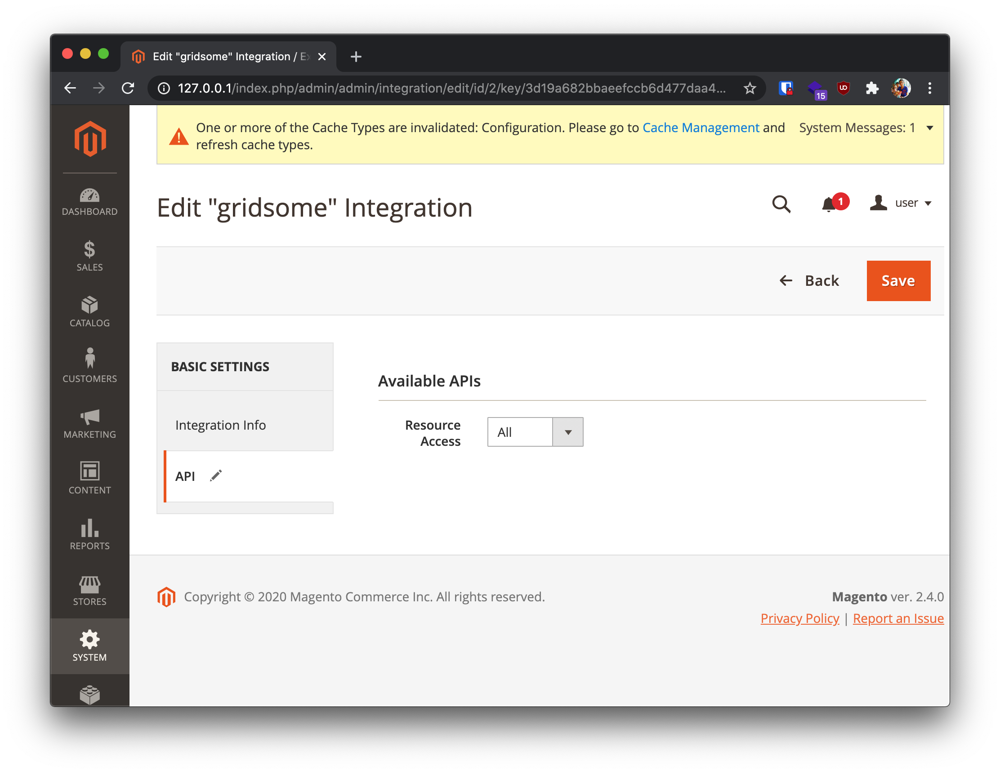

# Gridsome source Magento
This is a Gridsome source for Magento 2 webshops.

It is currently in development. Pull requests are welcome.

## Usage
### Installing
Add the plugin in `gridsome.config.js` and fill in your Magento integration credentials:
```javascript
plugins: [
    {
      use: 'gridsome-source-magento',
      options: {
        url: 'http://localhost/index.php/rest',
        consumerKey: '<CONSUMER_KEY>',
        consumerSecret: '<CONSUMER_SECRET>',
        accessToken: '<ACCESS_TOKEN>',
        accessTokenSecret: '<ACCESS_TOKEN_SECRET>'
      }
    }
  ]
```

### Creating product pages
To create a page for each product, put the following in `gridsome.server.js`:
```javascript
api.createPages(async ({graphql, createPage}) => {
        const {data} = await graphql(`query allProducts{
            allProducts{
                edges {
                  node {
                    name
                    custom_attributes {
                      attribute_code
                      value
                    }
                  }
                }
              }
            }`);
        data.allProducts.edges.forEach(node => {
            const slug = node.node.custom_attributes.find(attribute => attribute.attribute_code === 'url_key');
            createPage({
                path: `/product/${slug.value}`,
                component: './src/templates/Product.vue'
            });
        })
    })
```

## Development

In [examples/example-webshop](examples/example-webshop) there is an example webshop which can be used for developing the plugin. By default, it uses the [Vue Storefront Magento demo](http://demo-magento2.vuestorefront.io)

### Run with Vue Storefront demo store:
Prerequisites:
- NPM (NodeJS): https://www.npmjs.com/get-npm
- Gridsome CLI: https://gridsome.org/docs/gridsome-cli/

Steps:

1. Clone or download this repository.
1. Cd to the [example-webshop](examples/example-webshop) directory: `cd examples/example-webshop`.
2. Install the npm modules in the example-webshop: `npm install`.
3. Run the example-webshop: `gridsome develop`.

### Run with local Magento container:
Prerequisites:
- Docker Compose: https://docs.docker.com/compose/install/

Steps:
1. Run Magento with docker-compose: `docker-compose up --build`.
2. Go to http://localhost/admin and login with username `user` and password `bitnami1`.
3. [Create Magento integration tokens](https://devdocs.magento.com/guides/v2.4/get-started/authentication/gs-authentication-token.html#integration-tokens). Make sure that the Integration has enough API Resource Access.

4. Cd to the [example-webshop](examples/example-webshop) directory: `cd examples/example-webshop`.
5. Change the placeholder credentials in [gridsome.config.js](examples/example-webshop/gridsome.config.js) to your credentials.
6. Install the npm modules in the example-webshop: `npm install`.
7. Run the example-webshop: `gridsome develop`.